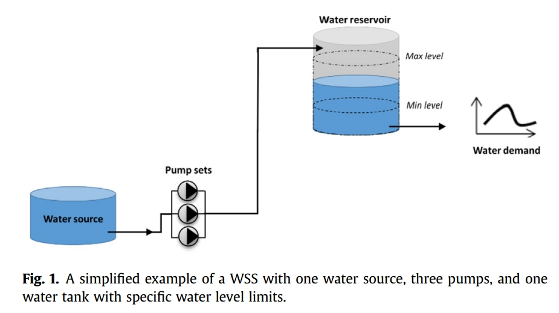

# 阅读笔记📕

一些供水管网泵站优化调度的论文

## [1] [Improving energy efficiency in water supply systems with pump scheduling optimization](https://www.sciencedirect.com/science/article/pii/S0959652618339064)

供水调度的终极目标是保证用户的用水需求，并同时保证供水所造成的能量消耗最小
供水优化调度的两种策略：
- 优化蓄水池水位，在蓄水池达到指定水位时会触发水泵的运行（当水池水位达到最低时会启动水泵运行，当水位达到最高时会停止水泵运行），也被称为ruled-based control optimization
- 优化水泵的运行策略，设定水泵在各个时段下的状态，即定义水泵在某个时段是开启或关闭
- 当然，还有以上两者结合的调度方式

本文的任务时计算各个泵站在24h中的运行状态，保证能量损耗最低，$`CO_2`$的含量最低，以及成本最低

优化的目标（或给出的方案）是：（1）使泵站的能量损失最小；（2）使泵站能耗最小+使水池水位在安全水位中

