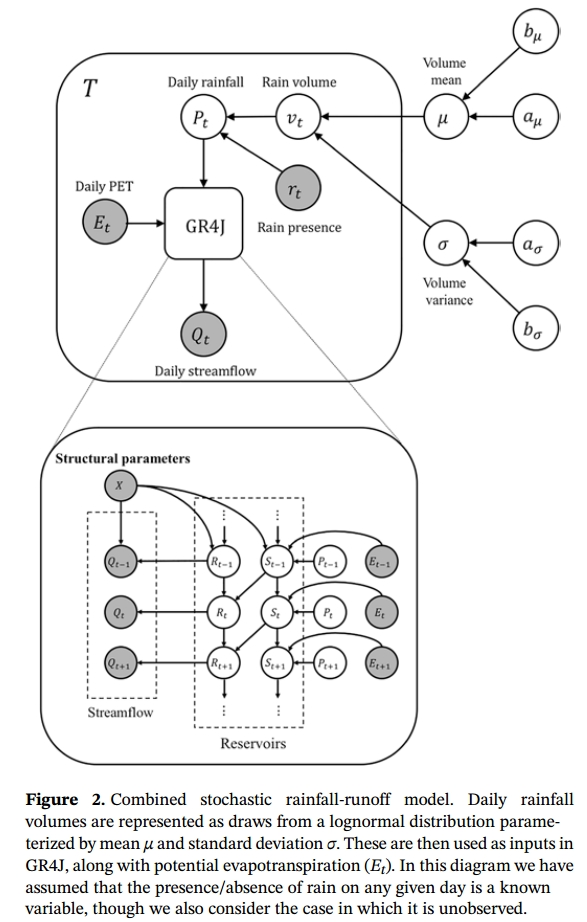

# 阅读笔记📕

一些水文模型参数优化的论文

## [1] [Gradient‐Based Inverse Estimation for a Rainfall‐Runoff Model](https://agupubs.onlinelibrary.wiley.com/doi/full/10.1029/2018WR024461)[⭐⭐⭐]

这篇论文的模型结构机理是相对简单的，即将水文模型的参数作为一种类似于神经网络参数的一种可微分计算(梯度计算)的参数，论文将梯度下降算法用于模型参数优化，并于Monto Carlo和贝叶斯的梯度优化算法进行对比，讨论了三个问题：
1. 深度学习框架反向计算的概念水温模型参数的可行性
2. 基于梯度的参数率定方法相比其他算法的准备性和适用性
3. 基于梯度的参数率定方法能否应用于参数较多的场景，如参数较多的分布式水文模型
论文所解决的问题似乎与通常的径流预测有所差别，论文首先构建了一个随机降雨径流模型

然后论文采用ADVI(Bayesian)以及三种Markov chain Monte Carlo方法，用于率定模型中的参数$`P_t`$和$`r_t`$，从而`reconstruct precipitation over several decades`
论文首先对比了不同长度下的降雨序列重构的方法率定性能，表明ADVI在较长的序列重构中比MCMC性能更强
然后将ADVI用于真实事件中的降雨序列重构，对比了1、10、30天尺度下的重构精度
这篇论文更多侧重于参数估计、不确定性领域，数学统计学概念较多，读起来有丢丢费力

## [2] [A Differentiable Hydrology Approach for Modeling With Time-Varying Parameters](https://agupubs.onlinelibrary.wiley.com/doi/10.1029/2021WR031377)
to be continue!