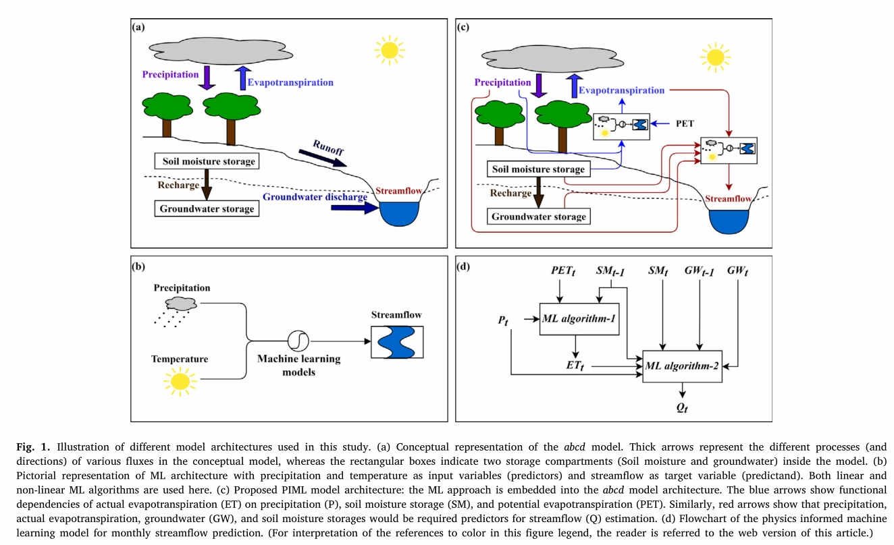
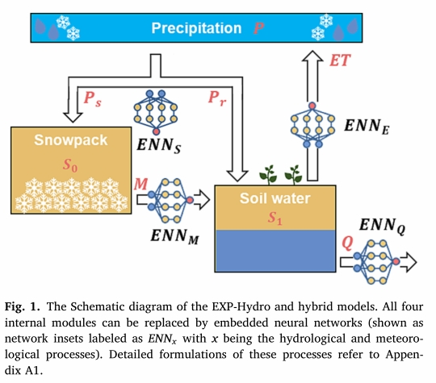
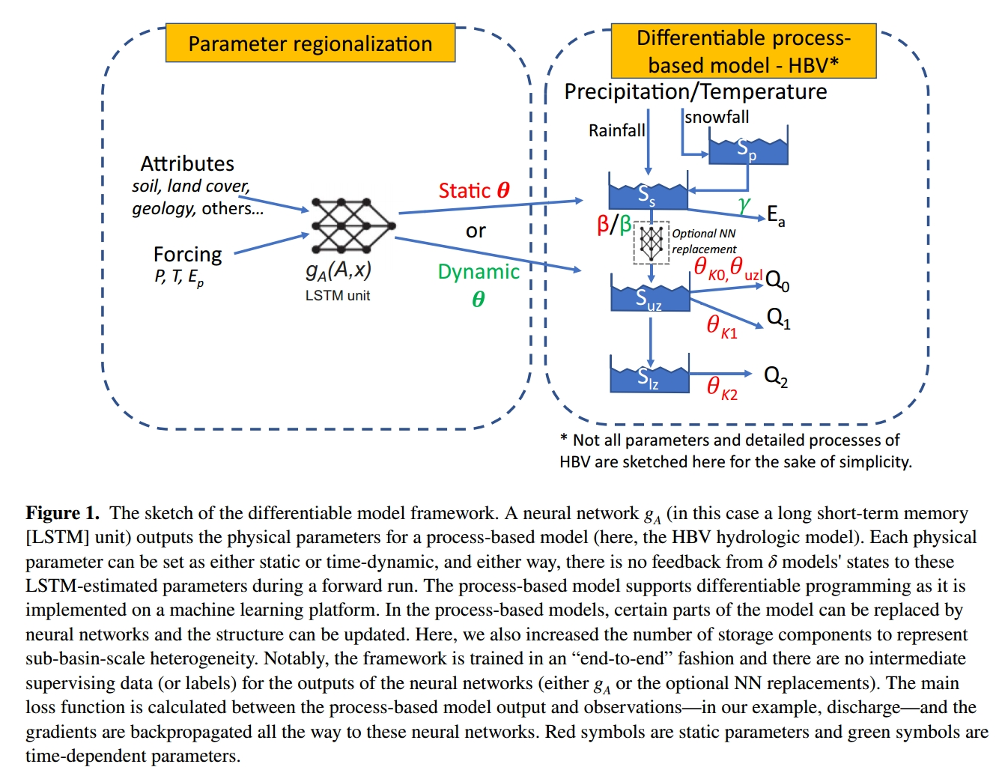
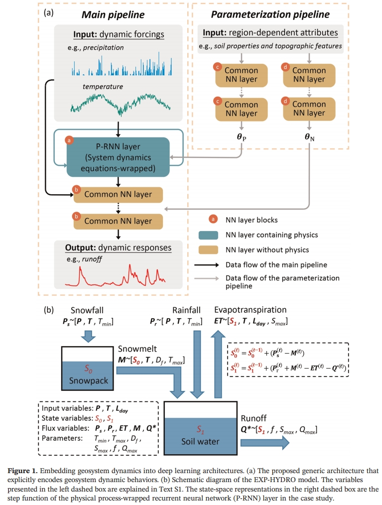
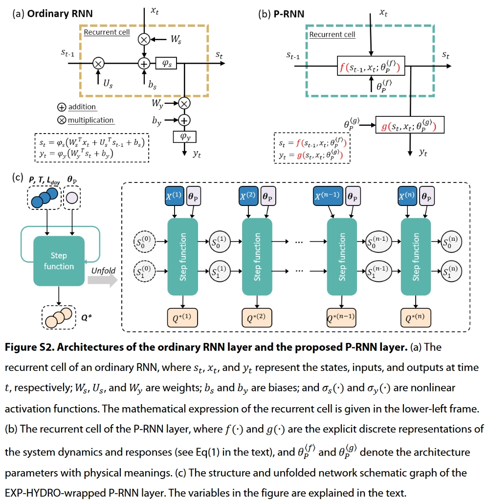
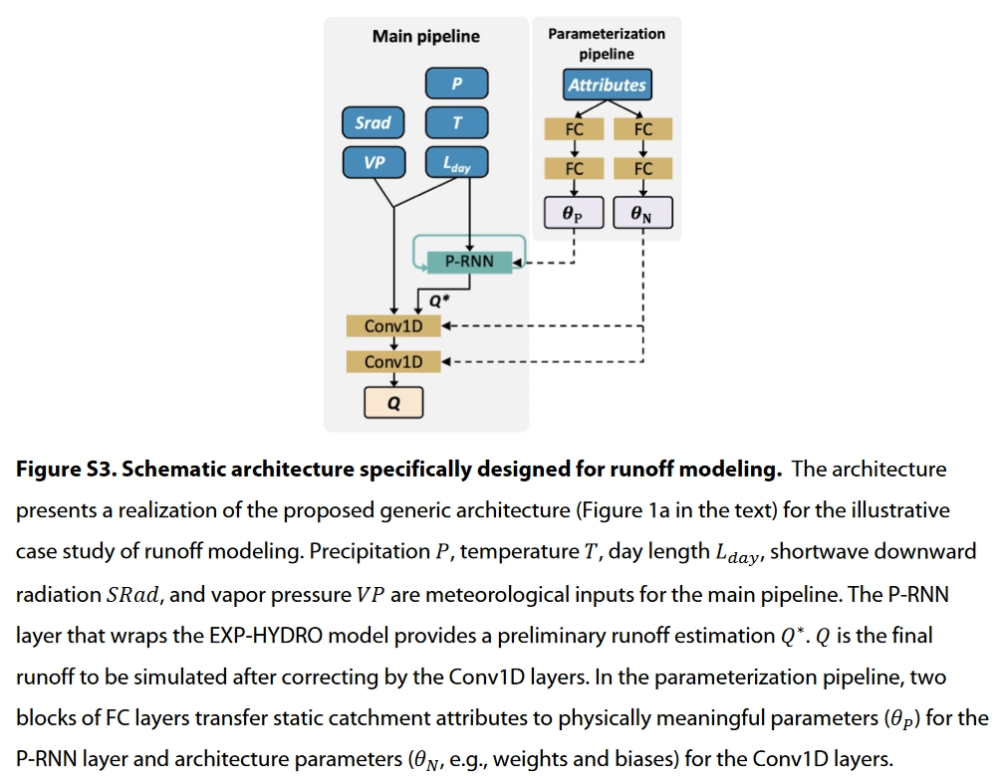
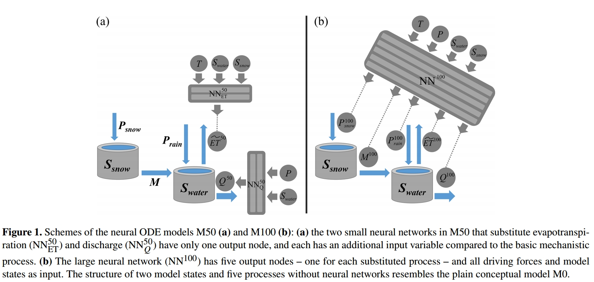

# 阅读笔记📕

一些物理机制与深度学习融合的论文

## 物理机制耦合

### [1] [Enhancing predictive skills in physically-consistent way:PhysicsInformed Machine Learning for hydrological processes, JH, 2023](https://www.sciencedirect.com/science/article/pii/S002216942201188X)[⭐⭐⭐]

论文概述：论文使用机器学习模型对abcd概念水文模型的一些经验公式进行替换，详细来说，通过机器学习模型替换了原水文模型中的蒸发计算公式以及产流计算公式，通过潜在蒸发量(t)、土壤含水量(t-1)、降雨量(t)来预测区域的实际蒸发量(t)，并通过土壤含水量(t-1)、土壤含水量(t)、降雨量(t)、地下含水量(t-1)和地下含水量(t)预测径流量(t)。结论表示这种物理机制耦合的模型在印度多个流域的月径流和实际蒸发预测中表现突出，且符合水量平衡机理(降雨量等于径流、实际蒸发量，土壤含水量和地下含水量的变化值)

### [2] [Enhancing process-based hydrological models with embedded neuralnetworks: A hybrid approach, JH, 2022](https://www.sciencedirect.com/science/article/pii/S0022169423010491)[⭐⭐⭐⭐⭐]

论文概述：论文使用神经网络模型(Linear(hidden_size=16,num_layers=2))替换了EXP-hydro模型的分别替换模型中计算模块，包括precipitation partition、snowmelt、evapotranspiration and runoff：使用温度、降雨构建precipitation partition的ENN模型；使用温度构建snowmelt的ENN模型；使用潜在蒸发和土壤含水构建evapotranspiration的ENN模型；最后使用土壤含水量、降雨和融雪构建runoff的ENN模型。

论文使用ENN模型对这些模块分别进行了替换，首先讨论替换某一个模块NN1的性能变化，结果表明，替换runoff模块后，模型的预测精度会显著增加；替换两个模块后NN2，模型精度大多比NN1更高，替换更多的模块后模型精度提升将不明显了。

论文关于一些内部机理的研究，论文关于内部机理的讨论非常透彻，通过设置假数据来论文模型对物理机理的反映，论文分别对precipitation partition、snowmelt和runoff三个模块ENN模型对物理机理的一些反映，主要体现出了物理机理中一些临界状态，如雨雪划分的温度，融雪温度和发生产流的临界土壤含水量，论文将这些临界值重新替换EXP-hydro的计算公式，使其预测精度有一定的提升。

### [3] [Differentiable, Learnable, Regionalized Process-Based Models With Multiphysical Outputs can Approach State-Of-The-Art Hydrologic Prediction Accuracy, WRR, 2022](https://agupubs.onlinelibrary.wiley.com/doi/10.1029/2022WR032404)[⭐⭐⭐⭐⭐]

论文使用LSTM模型对HBV模型的一些参数（包括静态参数和动态参数）进行预测，动态参数其一是替换了蒸发计算公式中的$\gamma$参数，以适应在不同季节中植被对蒸发的作用，其二是替换了产流计算中的$\beta$参数，反映土壤含水的有效产流量关系，并通过动态变化反映历史观测对产流的影响；静态参数$\theta$则是反映流域模型的参数空间差异性。同时论文使用神经网络替换了地面产流计算公式，通过训练更好的反映两者的关系，相比原来的固定的计算公式，或可能得到更高的预测性能。

 

论文首先对比了dPL+HBV with one ($\delta_1()$) and mulitiple componets ($\delta_n()$)，同时还对比了加入动态参数$\beta$($\delta_n(\beta^t)$)以及神经网络NN替换产流计算公式的 $\delta_n(NN_r)$这几个模型在CAMELS数据集上的预测性能，同时采用特殊的损失函数平衡峰值和谷值的误差。训练结果表明模型$\delta_n$的预测精度与LSTM接近，同时中间状态与验证数据BFI和ET有着较高的相关性，反映了模型既能够贴近LSTM的预测精度，其中间状态也能够反映一些物理变量。增加多个并行计算单元(mulitiple componets)可以显著提升模型精度，而加入动态参数则能够进一步提升模型精度，剖析参数优化结果可以发现其存在季节性变化。

### [4] [Improving AI System Awareness of Geoscience Knowledge: Symbiotic Integration of Physical Approaches and Deep Learning, GRL, 2020](https://agupubs.onlinelibrary.wiley.com/doi/full/10.1029/2020GL088229)[⭐⭐⭐⭐⭐]

论文提出了一个物理过程耦合的循环神经网络模型P-RNN，将EXP-HYDRO模型的水循环计算过程作为RNN模型的计算过程，将RNN模型初始状态类比水文模型的初始状态($S_0$和$S_1$)，然后仿照RNN模型的计算思路，通过输入各个时段下的气象观测数据和通过额外神经层预测的水文模型参数(通过地区特征预测水文模型参数)，获取各个时段的中间状态，也即是土壤状态，然后再将各时段的土壤状态导出，再使用EXP-HYDRO水文模型的产流计算公式得到径流过程的计算结果。

注：我在阅读源码中并没有发现$\theta_N$传入Conv1D层的计算过程。

论文首先是对比了各个模型(hybrid, CNN1D, PRNN, LSTM)在CAMELS的性能，结果是表明在各个流域下hybrid的模型精度最优，且洪峰预测能力更强，但是若是LSTM+CNN1D呢？

然后论文验证了hybrid模型在无资料地区的预测性能，结果表明加入流域的一些静态特征对于无资料地区的预测有很大的提升，hydrid的预测性能相较于LSTM更为稳定。

**需要注意的是**：实验一的模型精度验证与无资料地区的预测精度验证存在一定差异，后面论文开展需要额外注意，前者是使用时间戳划分各个流域，得到训练集和测试集，后者则是通过KFlod(5)划分各个流域(干旱地区)，通过模型训练其中四组流域后，在另一组流域中进行验证。

关于模型可解释性的研究，论文将模型的中间状态$S_0$与另一个数据集的daily snow water equivalent数据进行相关性分析，结果表明之间较高的相关性

### [5] [Improving hydrologic models for predictions and process understanding using neural ODEs, HESS, 2022](https://hess.copernicus.org/articles/26/5085/2022/)[⭐⭐⭐⭐⭐]

当前深度学习应用于水文预报上存在的问题: 可解释性, 固定预测步长, 先验知识

论文使用NeuralODE技术，将神经网络耦合到EXP-Hydro模型中，通过神经网络替换部分计算公式提升模型预测精度：M50模型使用神经网络替换了蒸发计算和产流的计算公式，使用$`NN_{ET}^{50}`$输入Temp、$`S_{water}`$和$`S_{snow}`$计算实际蒸发量，使用$`NN_{Q}^{50}`$输入P和$`S_{water}`$计算产流量；M100模型则是使用神经网络$`NN^{100}`$输入T、P、$`S_{water}`$和$`S_{snow}`$直接替代雨雪划分、融雪计算和蒸发计算等多个计算板块，然后预测出各个中间状态计算土壤含水的计算结果。
模型使用神经网络结合水文模型的计算公式构建ode方程，通过`DifferetialEquation.jl`求解方程，并通过`BlackBoxOptimization.jl`优化神经网络参数。模型的训练方式是首先通过`BlackBoxOptimization.jl`优化EXP-Hydro的模型参数，然后将这个参数带入到M50和M100中，并且还要将EXP-Hydro的中间状态作为NN模型的预训练样本，然后再带入到M50和M100中对模型参数进一步调整优化。

注：这个部分由于作者使用的优化算法与python中优化神经网络模型的梯度下降法有差异，模型优化的结果存在一定差别。

论文首先将M50和M100与LSTM和[4]中Hybrid模型进行比较，然后结果其实差不多，论文更多的是提出一种新的模型耦合思路吧

然后论文同样将模型的中间状态$`S_{water}`$和$`S_{snow}`$展开分析，在预测结果精度较高时各模型中间状态基本一致，而在精度较差时，EXP-Hydro模型的中间状态就与另外两个模型存在差异；此外在M50和M100中$`S_{snow}`$同样表现出与daily snow water equivalent存在相关性；同时论文还对三个模型中$`S_{snow}`$与Q和log(Q)的线性关系进行分析，发现M100模型在两个典型流域中更贴近于实际最大径流量；论文从降雨和$`S_{water}`$两个因素的共同作用对产流量计算结果的影响，一方面分析出流域产流的临界土壤含水，另一方面又发现了在M50和M100中，降雨的增加反而会降低产流，论文将其归结于不确定性，同时论文也讨论了气温和$`S_{water}`$对于蒸发的影响，以及气温和$`S_{snow}`$对于融雪径流的影响，具体分析结果可以参考原文。

注：这篇论文我对源码进行了深入的剖析，发现这个模型存在的几点问题：
- 模型更多的是模拟，对于实时预测（如批次训练）或可能不太支持，因为初始土壤含水对于模型计算尤其是批次训练有着非常大的影响；
- 然后模型的水文参数是固定的，相较于[3]和[4]的工作，对于参数的季节性变化，该论文考虑不太够
- 模型的计算效率相当低，continuous ode solver相比discrete ode需要的计算资源更大，在不考虑非规则时间序列的情况下，continuous ode的意义可能不大
- 将julia代码迁移到python后，模型的预测精度没有那么好，有可能是优化算法的选择差异导致