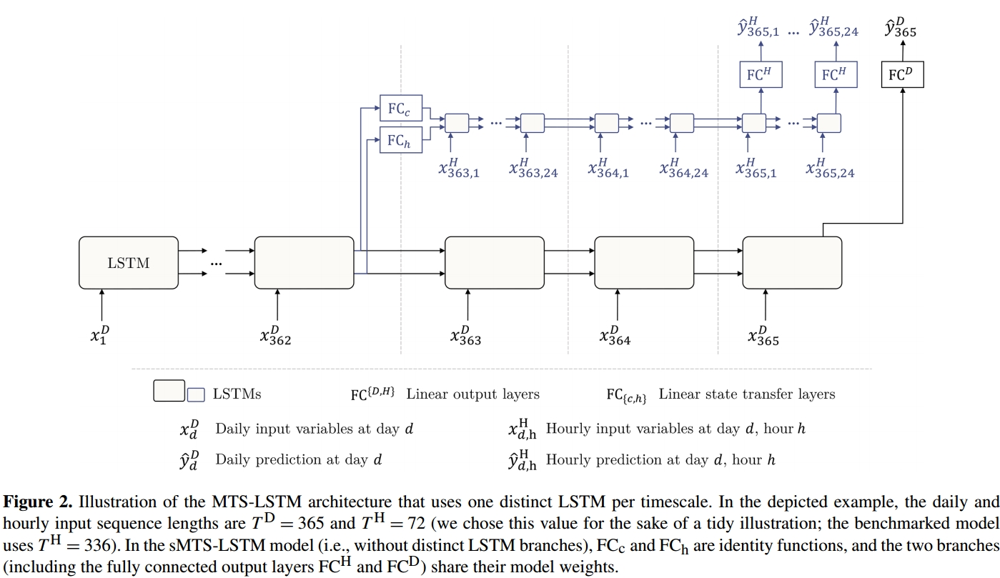

# 阅读笔记📕

一些深度学习应用于径流预测的论文

## [1] [Rainfall–runoff prediction at multiple timescales with a single Long Short-Term Memory network, HESS, 2021](https://hess.copernicus.org/articles/25/2045/2021/)[⭐⭐⭐⭐]

论文提出了一个多时间尺度输入的sub-daily径流预报模型，模型接受多个尺度的数据，这种模型可以输出1-hourly,3-hourly,6-hourly等多个时间尺度的径流预报结果，同时模型还能够接受多源数据，提升模型预测精度
模型解决的一些问题：
- 避免单独使用sub-daily数据时，输入look back太大导致的模型计算性能较低，在模型训练中，模型不关心相对久远的sub-daily数据，反而，为模型提供以前的daily数据可能会带来更多的输入信息，并减小模型的训练成本

论文主要提出两个改进的LSTM模型：

1. shared multi-timescale LSTM(sMTS-LSTM)：该模型针对日尺度和小时尺度数据训练两次(forward twice)，重复使用模型的内部状态，具体来说sMTS-LSTM模型首先输入日尺度数据得到日尺度的预测结果，然后再利用计算后的中间状态再输入小时尺度数据获取小时尺度的预测结果。同时为使模型能够区分不同尺度的数据，论文还想数据添加one-hot的时间尺度标注。这个模型的核心是小时尺度的预测是在日尺度的中间状态之上，避免了较长look back的数据输入。
2. multi-timescale LSTM(MTS-LSTM, 见模型结构图)：这个模型区别于sMTS-LSTM是使用两个LSTM模型分别计算日尺度和小时尺度的预测结果，两个计算过程的内部权重是不共享的，这个模型是先预测出日尺度的预测结果并得到模型的中间状态，然后再将这个中间状态作为小时尺度的模型状态的初始值，以此预测小时尺度的径流过程。相比sMTS-LSTM这个模型输入的维度会更加的灵活，模型可以构建多个LSTM分别用于不同数据源的数据

